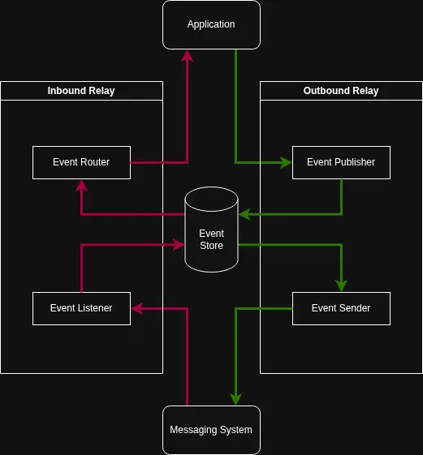

# 이벤트 통신 모듈

마이크로 서비스 간 이벤트 통신 지원 모듈입니다.

## 모듈 아키텍처 다이어그램

## 이벤트 정의 방법

각 서비스는 비즈니스 로직 실행 후 만들어질 이벤트의 페이로드 스키마, 고유 식별자(`EventKey`), 이벤트 발행자를 정의한 EventDefinition을 노출합니다.

Order 생성 시 만들어질 이벤트에 대한 EventDefinition 정의 시 고유 식별자는 `order.created` 등이 될 수 있고, 이벤트 발행자는 `order-service` 등이 될 수 있습니다. 

## 이벤트 생성 방법 (Outbound 흐름)

서비스가 생성하고자 하는 이벤트가 있다면, `EventPublisher`를 통해서 이벤트를 생성할 수 있습니다.

서비스가 비즈니스 로직을 실행하는 시점에 알아낼 수 있는 맥락 정보가 따로 있다면 `EventDynamicContextFactory`를 통해서 생성할 수 있습니다. 이 팩토리는 `EventTrace`에 담길 정보를 만들 수 있고, 동적으로 만들 수 있는 정보와 모듈이 주입하는 정보는 아래 테이블과 같습니다.

| 필드 명            | 설명                                         | 비고                                                                                                              |
|-----------------|--------------------------------------------|-----------------------------------------------------------------------------------------------------------------|
| `aggregateType` | 도메인 애그리거트 타입 정보 (`order`, `reservation` 등) | `이벤트 생성 시점에서 `EventDynamicContext`에 포함시켜야함                                                                      |
| `aggregateId`   | 도메인 애그리거트 식별자                              | 이벤트 생성 시점에서 `EventDynamicContext`에 포함시켜야함                                                                       |
| `correlationId` | 요청 단위 식별자                                  | 요청 단위 시작점일 경우 안 넣으면 `CorrelationProvider`에 의해 새로운 식별자 부여받음, 실행되는 비즈니스 로직이 진행중인 요청의 일부라면 `correlationId`를 포함시켜야함 |
| `causationId`   | 특정 이벤트를 발생시킨 원인이 되는 이벤트의 식별자               | Nullable 필드로 없으면 안 넣어도 됨                                                                                        |
| `producer`      | 이벤트 발행자                                    | `EventTraceFactory`에서 `ProducerProvider`를 주입받아서 모듈이 자동으로 값을 생성 및 주입함                                            |
| `eventId`       | 이벤트 식별자                                    | `EventTraceFactory`에서 `EventIdProvider`를 주입받아서 모듈이 자동으로 값을 생성 및 주입함                                             |

## 이벤트 처리 방법 (Inbound 흐름)

서비스가 처리하고자 하는 이벤트가 있다면, 그 이벤트 정의(`EventDefinition`)가 포함된 패키지를 의존성에 추가할 수 있습니다.

`EventDefinitionRegistrar`은 `EventDefinition` Bean을 모두 수집하여 이벤트 정의 레지스트리를 구성합니다.

서비스는 `EventListener` 구현체를 Bean으로 등록해서 `EventListenerRegistrar`의 Bean 수집 대상에 포함시킬 수 있습니다.

`EventListener` 구현 시, 처리하고자 하는 이벤트의 고유 식별자(`EventKey`)가 `EventDefinitionRegistrar`에 등록된 `EventDefinition` 중 하나와 일치해야합니다.

`EventListenerRegistrar`에 등록된 `EventListener`에 한해서, 네트워크 인프라(메세징 시스템)로부터 시스템 내부로 진입하는 메시지를 수집하고, `EventRouter`에 의해 적절한 `EventListener`로 메시지가 전달됩니다.